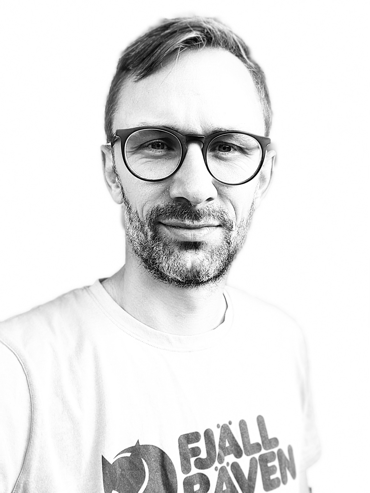

 
 
 

:::::::::::::: {.columns}
::: {.column width="40%"}

## About me
I am data scientist. My passion includes machine learning, optimization, data analysis and coding. My goal is to contribute to society with game-changing solutions based on data. I have a MsC in Economics from University of Southern Denmark.

 

## Programming
Python, R, git, Shell, Linux, SQL, Docker

 

:::
::: {.column width="60%"}

{width=40%}

:::
::::::::::::::

## Technical
Classification, Regression, Data Engineering, Feature Enginering, Visualization, Optimization, Time Series Forecasting, Business Intelligence

 

## Tools & Frameworks
scikit-learn, OrTools, Tidyverse, gganimate, RMarkdown, TensorFlow, Keras, Pandas, Numpy etc.

 

## Personal life
Outside of work, I like to bake pizza to my lovely family, running, MTB-biking, hiking and sauna bathing. I live with my wife and our three children in Horsens, Denmark.